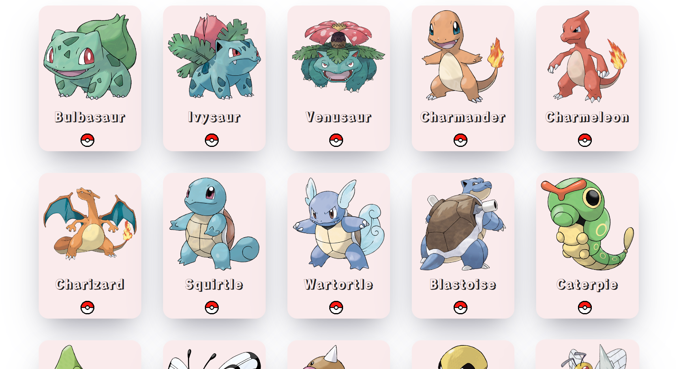
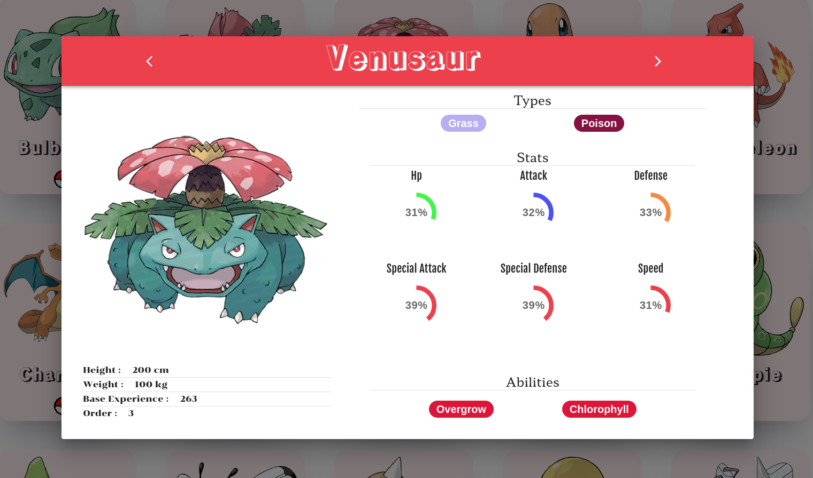

# Pokemon show

___

___

___

## Run the app locally

* #### run `yarn start`
* #### go to `http://localhost:3000`

___

## Run the tests

* #### e2e test example can be found in ./cypress/e2e/pokemonsPage.spec.cy.ts `yarn e2e`
* #### rtl test example can be found in ./src/pages/Pokemonpage/Pokemonpage.test.tsx `yarn test`
